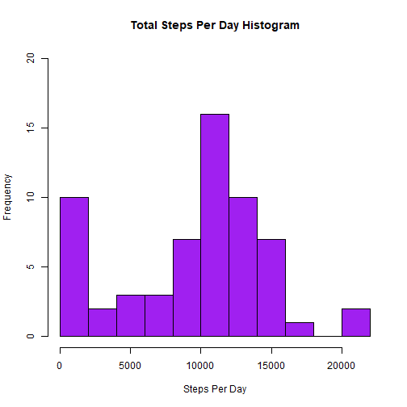
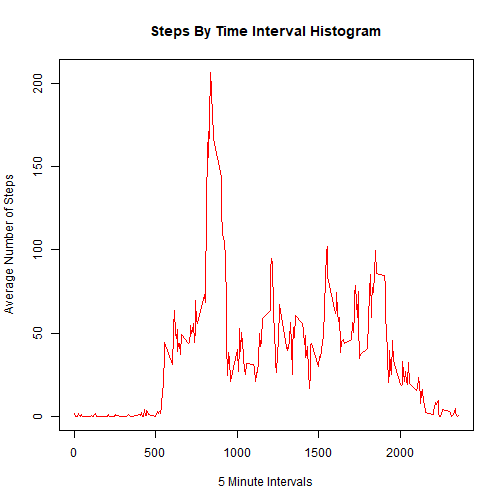
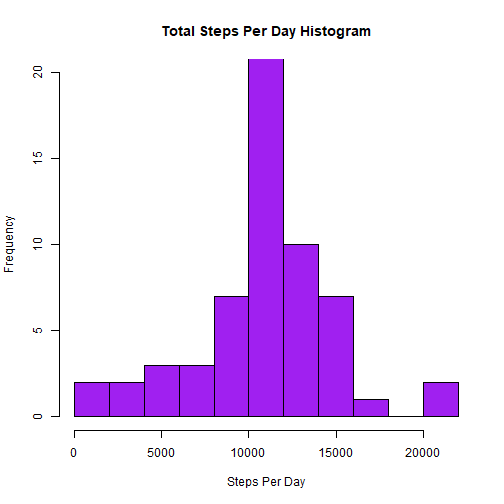
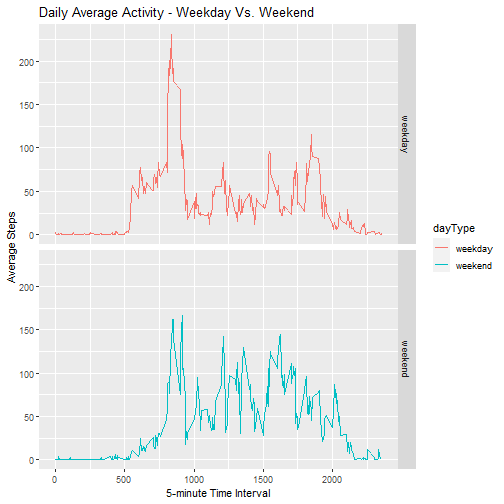

---
author: "Pierre Shi"
date: "12/29/2020"
output: html_document
---


## Introduction

It is now possible to collect a large amount of data about personal movement using activity monitoring devices such as a Fitbit, Nike Fuelband, or Jawbone Up. These type of devices are part of the “quantified self” movement – a group of enthusiasts who take measurements about themselves regularly to improve their health, to find patterns in their behavior, or because they are tech geeks. But these data remain under-utilized both because the raw data are hard to obtain and there is a lack of statistical methods and software for processing and interpreting the data.
We are making use of data from a personal activity monitoring device. This device collects data at 5 minute intervals through out the day. The data consists of two months of data from an anonymous individual collected during the months of October and November, 2012 and include the number of steps taken in 5 minute intervals each day.

## Loading and preprocessing the data
First, download the data file and unzip it.


```r
library(dplyr)
library(ggplot2)
library(knitr)

download.file(url = 'https://d396qusza40orc.cloudfront.net/repdata/data/activity.zip',destfile = 'myData.zip')
unzip(zipfile = 'myData.zip')
activity <- read.csv("./activity.csv")
activity$date <- as.Date(activity$date)
```

## What is mean total number of steps taken per day?

1.	Calculate the total number of steps taken per day:


```r
dailySteps <- activity %>%
  group_by(date) %>%
  summarize(totalSteps = sum(steps, na.rm = TRUE)) 
```

```
## `summarise()` ungrouping output (override with `.groups` argument)
```

```r
  head(dailySteps,15)
```

```
## # A tibble: 15 x 2
##    date       totalSteps
##    <date>          <int>
##  1 2012-10-01          0
##  2 2012-10-02        126
##  3 2012-10-03      11352
##  4 2012-10-04      12116
##  5 2012-10-05      13294
##  6 2012-10-06      15420
##  7 2012-10-07      11015
##  8 2012-10-08          0
##  9 2012-10-09      12811
## 10 2012-10-10       9900
## 11 2012-10-11      10304
## 12 2012-10-12      17382
## 13 2012-10-13      12426
## 14 2012-10-14      15098
## 15 2012-10-15      10139
```

2. Make a histogram of the total number of steps taken each day


```r
TotalStepPerDayPlot <- hist(dailySteps$totalSteps, main = "Total Steps Per Day Histogram", 
xlab = "Steps Per Day", ylab = "Frequency", col = "purple", breaks = 10, ylim =c(0,20))
```



3.	Calculate and report the mean and median of the total number of steps taken per day


```r
meanStepPerDay <- round(mean(dailySteps$totalSteps),digits = 3)
medianStepPerDay <- median(dailySteps$totalSteps)
displayMean <- paste("The calculated mean is: ", meanStepPerDay)
displayMedian <- paste("The calculated median is: ", medianStepPerDay)
print(displayMean)
```

```
## [1] "The calculated mean is:  9354.23"
```

```r
print(displayMedian)
```

```
## [1] "The calculated median is:  10395"
```

## What is the average daily activity pattern?

1.	Make a time series plot of the 5-minute interval (x-axis) and the average number of steps taken, averaged across all days (y-axis)

```r
averageStepsPerInterval <- activity %>%
        group_by(interval) %>%
        summarize(average = mean(steps, na.rm = TRUE)) 
```

```
## `summarise()` ungrouping output (override with `.groups` argument)
```

```r
head(averageStepsPerInterval,15)
```

```
## # A tibble: 15 x 2
##    interval average
##       <int>   <dbl>
##  1        0  1.72  
##  2        5  0.340 
##  3       10  0.132 
##  4       15  0.151 
##  5       20  0.0755
##  6       25  2.09  
##  7       30  0.528 
##  8       35  0.868 
##  9       40  0     
## 10       45  1.47  
## 11       50  0.302 
## 12       55  0.132 
## 13      100  0.321 
## 14      105  0.679 
## 15      110  0.151
```

```r
plot(x = averageStepsPerInterval$interval , y = averageStepsPerInterval$average, col="red", type="l", xlab = "5 Minute Intervals", ylab = "Average Number of Steps", main = "Steps By Time Interval Histogram")
```



2. Which 5-minute interval, on average across all the days in the dataset, contains the maximum number of steps?


```r
print(paste("5-minute Interval containing the maximum steps: ",averageStepsPerInterval$interval[which.max(averageStepsPerInterval$average)]))
```

```
## [1] "5-minute Interval containing the maximum steps:  835"
```

```r
print(paste("Average steps for the calculated interval: ",round(max(averageStepsPerInterval$average),digits=3)))
```

```
## [1] "Average steps for the calculated interval:  206.17"
```


## Imputing missing values

1.	Calculate and report the total number of missing values in the dataset (i.e. the total number of rows with NAs)


```r
missingNA <- sum(is.na(activity$steps))
print(paste("The total number of missing values in the dataset is: ",missingNA))
```

```
## [1] "The total number of missing values in the dataset is:  2304"
```

2.	Devise a strategy for filling in all of the missing values in the dataset. The strategy does not need to be sophisticated. For example, you could use the mean/median for that day, or the mean for that 5-minute interval, etc.

My strategy is to use the mean for that 5-minute interval to fill in the missing data NA, for the correpondent interval. Create a new dataset called "activityWithoutNA" that is equal to the original dataset but with the missing data filled in


```r
activityWithoutNA <- activity  
for (i in 1:nrow(activity)){
  if(is.na(activity$steps[i])){
    activityWithoutNA$steps[i]<-averageStepsPerInterval$average[activityWithoutNA$interval[i] == averageStepsPerInterval$interval]
        }
}
head(activityWithoutNA,15)
```

```
##        steps       date interval
## 1  1.7169811 2012-10-01        0
## 2  0.3396226 2012-10-01        5
## 3  0.1320755 2012-10-01       10
## 4  0.1509434 2012-10-01       15
## 5  0.0754717 2012-10-01       20
## 6  2.0943396 2012-10-01       25
## 7  0.5283019 2012-10-01       30
## 8  0.8679245 2012-10-01       35
## 9  0.0000000 2012-10-01       40
## 10 1.4716981 2012-10-01       45
## 11 0.3018868 2012-10-01       50
## 12 0.1320755 2012-10-01       55
## 13 0.3207547 2012-10-01      100
## 14 0.6792453 2012-10-01      105
## 15 0.1509434 2012-10-01      110
```

```r
updatedDailyStep <- activityWithoutNA %>%
        group_by(date) %>%
        summarize(totalSteps = sum(steps, na.rm = TRUE)) 
```

```
## `summarise()` ungrouping output (override with `.groups` argument)
```

```r
head(updatedDailyStep,15)
```

```
## # A tibble: 15 x 2
##    date       totalSteps
##    <date>          <dbl>
##  1 2012-10-01     10766.
##  2 2012-10-02       126 
##  3 2012-10-03     11352 
##  4 2012-10-04     12116 
##  5 2012-10-05     13294 
##  6 2012-10-06     15420 
##  7 2012-10-07     11015 
##  8 2012-10-08     10766.
##  9 2012-10-09     12811 
## 10 2012-10-10      9900 
## 11 2012-10-11     10304 
## 12 2012-10-12     17382 
## 13 2012-10-13     12426 
## 14 2012-10-14     15098 
## 15 2012-10-15     10139
```

3. Make a histogram of the total number of steps taken each day and Calculate and report the mean and median total number of steps taken per day. Do these values differ from the estimates from the first part of the assignment? What is the impact of imputing missing data on the estimates of the total daily number of steps?


```r
updatedTotalStepPerDayPlot <- hist(updatedDailyStep$totalSteps, main = "Total Steps Per Day Histogram", 
xlab = "Steps Per Day", ylab = "Frequency", col = "purple", breaks = 10, ylim =c(0,20))
```



Calculate the impact by the updated mean and median values based on new dataset. 


```r
updatedMean <- round(mean(updatedDailyStep$totalSteps), digits = 3)
updatedMedian <- median(updatedDailyStep$totalSteps)
```

Here below compares the original mean value, against the updated mean value when NA is imputed


```r
meanStepPerDay
```

```
## [1] 9354.23
```

```r
updatedMean
```

```
## [1] 10766.19
```

Here below compares the original median value, against the updated median value when NA is imputed


```r
medianStepPerDay
```

```
## [1] 10395
```

```r
updatedMedian
```

```
## [1] 10766.19
```

As shown above there is slight change of Mean and Median values when the NA is imputed. 

## Are there differences in activity patterns between weekdays and weekends?

1.	Create a new factor variable in the dataset with two levels – “weekday” and “weekend” indicating whether a given date is a weekday or weekend day.

Here we created a new set called "activityWW" to flag the weekend or weekday types. 


```r
activityWW <- mutate(activityWithoutNA, dayType = 
  ifelse(weekdays(activityWithoutNA$date) == "Saturday" | 
  weekdays(activityWithoutNA$date) == "Sunday", "weekend", "weekday"))

activityWW$dayType <- as.factor(activityWW$dayType)
head(activityWW) 
```

```
##       steps       date interval dayType
## 1 1.7169811 2012-10-01        0 weekday
## 2 0.3396226 2012-10-01        5 weekday
## 3 0.1320755 2012-10-01       10 weekday
## 4 0.1509434 2012-10-01       15 weekday
## 5 0.0754717 2012-10-01       20 weekday
## 6 2.0943396 2012-10-01       25 weekday
```

```r
averageInterval <- activityWW %>%
  group_by(interval, dayType) %>%
  summarise(steps = mean(steps))
```

```
## `summarise()` regrouping output by 'interval' (override with `.groups` argument)
```

2.	Make a panel plot containing a time series plot of the 5-minute interval (x-axis) and the average number of steps taken, averaged across all weekday days or weekend days (y-axis). 

```r
myWWPlot <- ggplot(averageInterval, aes(x=interval, y=steps, 
  color = dayType)) +
  geom_line() +
  facet_grid(dayType ~ .) + 
  labs(title = "Daily Average Activity - Weekday Vs. Weekend", x= "5-minute Time Interval", y = "Average Steps") 
print(myWWPlot)
```



### Conclusion from the new plot:

From this we can see there are some differences in the weekend and weekday pattern. We can see there is a big peak in the beginning of the weekdays, but in weekend there are several peaks. This means some of the people started activities in weekdays early and they may go to study or work afterwards. 
